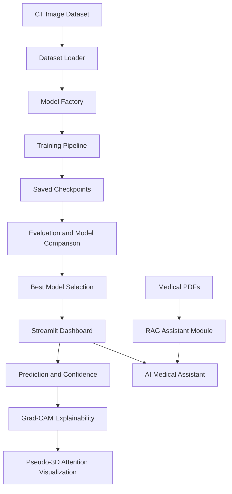

# Agentic Lung Tumor CT Analysis System

> Explainable deep learning dashboard for lung CT tumor classification, Grad-CAM attention, pseudo-3D visualization, and conversational medical AI support.


## Hero

Agentic Lung Tumor CT Analysis System is a research-grade AI application for classifying lung CT images into tumor-related categories and explaining model behavior visually. The system combines PyTorch image classification, Grad-CAM explainability, pseudo-3D attention rendering, model comparison, and a Streamlit-based AI Medical Assistant.

It is built to demonstrate practical medical AI engineering: data loading, training, evaluation, explainability, dashboard design, and safety-aware conversational support in one cohesive project.

> **Warning:** This project is a research prototype and not a clinical diagnostic tool.

## Repository About

Explainable lung CT tumor classification dashboard with Grad-CAM, pseudo-3D visualization, and AI assistant.

## Suggested GitHub Topics

`medical-ai` `pytorch` `streamlit` `grad-cam` `computer-vision` `lung-cancer` `explainable-ai`

## Demo Screenshots

Place demo screenshots in `docs/images/` using these paths:

| Dashboard | Grad-CAM |
|---|---|
| `docs/images/dashboard.png` | `docs/images/gradcam.png` |

| Pseudo-3D | Chatbot |
|---|---|
| `docs/images/pseudo_3d.png` | `docs/images/chatbot.png` |

## Key Features

- **Four-class CT classification:** adenocarcinoma, large cell carcinoma, normal, squamous cell carcinoma
- **Model factory:** ResNet50, DenseNet121, EfficientNet-B0
- **Automated model comparison:** selects best checkpoint using weighted F1-score
- **Grad-CAM explainability:** heatmap and overlay visualization for model focus
- **Pseudo-3D visualization:** Grad-CAM-guided 3D surface and attention volume
- **AI Medical Assistant:** intent-aware chatbot for non-medical explanations
- **Clinical-style support note:** structured explanation with safety guidance
- **Medical-paper RAG module:** PDF ingestion and retrieval-ready assistant module
- **GitHub-ready project structure:** docs, license, requirements, and release-safe ignore rules

## System Architecture



See [docs/architecture.md](docs/architecture.md) for the full system design.

## Model Pipeline

1. Load CT images from `data/Data/{train,valid,test}`.
2. Apply resizing, tensor conversion, and ImageNet normalization.
3. Train a selected model architecture from `src/model_factory.py`.
4. Save the best validation checkpoint to `models/best_<model_name>.pth`.
5. Evaluate test metrics and compare models using `src/compare_models.py`.
6. Load the best selected model automatically in the Streamlit app.
7. Generate Grad-CAM and pseudo-3D visual explanations for uploaded CT images.

## Model Comparison

| Model | Status | Test Accuracy | Weighted F1 |
| --- | --- | --- | --- |
| ResNet50 | Evaluated | 91.43% | 91.43% |
| DenseNet121 | Pending checkpoint | Placeholder | Placeholder |
| EfficientNet-B0 | Pending checkpoint | Placeholder | Placeholder |

Detailed comparison notes are available in [docs/model_comparison.md](docs/model_comparison.md).

## Installation

```bash
git clone https://github.com/rama9618/agentic-lung-ct-ai.git
cd agentic-lung-ct-ai
pip install -r requirements.txt
```

## How To Run

Launch the dashboard:

```bash
streamlit run src/app.py
```

Then upload a CT image and review:

- Predicted class
- Confidence score
- Grad-CAM heatmap
- Heatmap overlay
- Pseudo-3D visualizations
- AI clinical support note
- AI Medical Assistant chatbot

More usage details are in [docs/usage.md](docs/usage.md).

## Training

Choose a model at the top of `src/train.py`:

```python
MODEL_NAME = "densenet121"
```

Train:

```bash
python src/train.py
```

Saved checkpoint:

```text
models/best_<model_name>.pth
```

## Evaluation

Evaluate a checkpoint:

```bash
python src/evaluate.py
```

Compare all supported checkpoints:

```bash
python src/compare_models.py
```

Generated reports:

```text
reports/test_evaluation.txt
reports/model_comparison.csv
reports/model_comparison.txt
reports/best_model.txt
```

## Roadmap

- MedSAM integration
- True DICOM/NIfTI support
- Real 3D reconstruction from CT volumes
- RAG assistant for medical papers
- Multi-model ensemble
- Meta Quest XR visualization
- Clinical-style PDF report generation

## Safety Disclaimer

This project is a research prototype and not a clinical diagnostic tool.

It must not be used to diagnose, rule out, monitor, or treat disease. Predictions, confidence scores, Grad-CAM heatmaps, pseudo-3D visualizations, chatbot responses, and generated reports require review by a qualified radiologist or physician.

See [docs/disclaimer.md](docs/disclaimer.md) for detailed safety limitations.

## Author

**Ramakanth Madira**

Medical AI, computer vision, explainability, and interactive AI systems.

## License

This project is released under the [MIT License](LICENSE).
