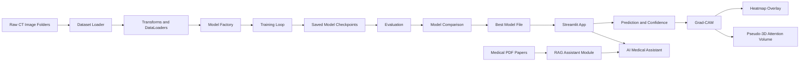

# Architecture

This document describes the end-to-end design of the Agentic Lung Tumor CT Analysis System.

## End-to-End Workflow

```text
Dataset → Preprocessing → Model Training → Evaluation → Best Model Selection
       → Streamlit Inference → Grad-CAM → Pseudo-3D Visualization → Chatbot
```

The system is designed around 2D CT images. It supports classification, explainability, pseudo-3D attention visualization, and conversational guidance for non-medical users.

## Data Flow Diagram



## Components

### Dataset Loader

File: `src/dataset.py`

Responsibilities:

- Read train, validation, and test folders
- Map dataset folder names to class labels
- Load images using PIL
- Convert images to RGB
- Resize and normalize images
- Build PyTorch datasets and dataloaders

### Model Factory

File: `src/model_factory.py`

Supported models:

- ResNet50
- DenseNet121
- EfficientNet-B0

The factory uses torchvision pretrained weights and replaces the final classifier layer for four output classes.

### Training

File: `src/train.py`

Responsibilities:

- Select model architecture with `MODEL_NAME`
- Train on the training split
- Validate on the validation split
- Save the best checkpoint by validation performance

Saved model format:

```text
models/best_<model_name>.pth
```

### Evaluation

Files:

- `src/evaluate.py`
- `src/compare_models.py`

Responsibilities:

- Evaluate checkpoint performance on the test set
- Compute loss, accuracy, precision, recall, and weighted F1
- Compare multiple model checkpoints
- Select the best model using weighted F1-score

### Grad-CAM

File: `src/gradcam.py`

Responsibilities:

- Hook into the final convolutional feature layer
- Compute gradients for the predicted class
- Generate class activation heatmaps
- Overlay heatmaps on the original CT image

### Pseudo-3D Visualization

File: `src/app.py`

Visualization modes:

- Grad-CAM-guided surface plot
- Multi-slice pseudo-3D attention volume

These are visual explanations generated from a single 2D CT image and Grad-CAM attention. They are not true CT volume reconstructions.

### AI Medical Assistant

File: `src/app.py`

Responsibilities:

- Maintain chat history in Streamlit session state
- Detect user intent
- Answer questions about predictions, confidence, Grad-CAM, pseudo-3D views, risk, next steps, and medical terms
- Provide safe, non-diagnostic guidance

### Streamlit UI

File: `src/app.py`

Dashboard sections:

- Upload CT image
- Active model and performance card
- Prediction result
- Confidence
- Grad-CAM heatmap and overlay
- AI clinical support note
- Pseudo-3D visualizations
- AI Medical Assistant

## Safety Boundary

This project is a research prototype and not a clinical diagnostic tool. It does not diagnose, rule out, or treat disease.
